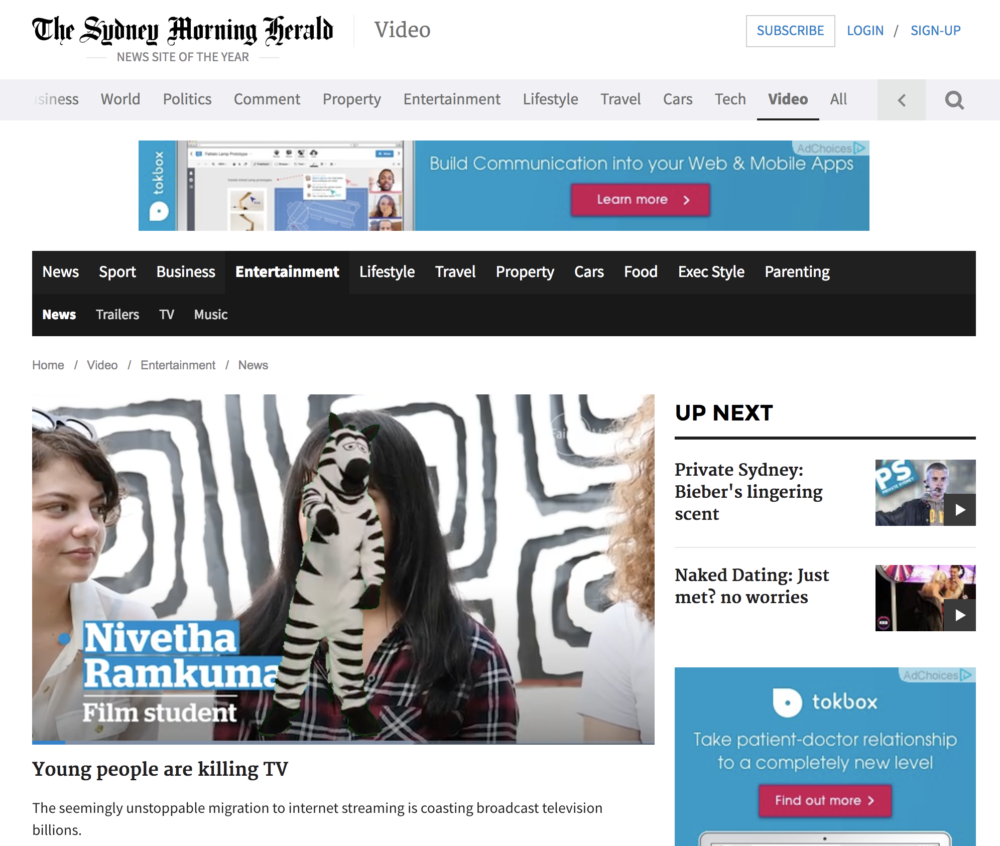

# zebra-extension
Chrome Extension which adds [John Oliver's dancing Bolivian Zebra](https://www.youtube.com/watch?v=pzheZlnz9TU) to any video on the page

# Usage

Simply [install the Chrome Extension](http://bit.ly/dancing-zebras) and then click the icon in your browser when you're on a page that has a video playing. Hilarity will ensue.

It works on [YouTube](http://youtube.com), [NY Times](http://nytimes.com), [Sydney Morning Herald](http://smh.com.au) and many more websites.

